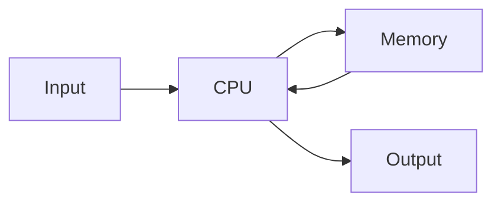

# Computer Architecture Notes

A zero-to-hero study guide for Computer Organization and Architecture (COA). Visual, simple, and exam-ready.

## Big picture

A computer takes input, processes it in the CPU, stores data in memory when needed, and produces output.

## How to use these notes

1. Start with Video 1 and go in order
2. Each note covers one video/topic with diagrams, examples, and a summary
3. Use the **Quick Revision** section at the bottom of each note for last-minute exam prep
4. Follow [NOTES_GUIDE.md](NOTES_GUIDE.md) when creating a new note

## Video-wise Roadmap

| Video | Topic | Note |
|-------|-------|------|
| 1 | Introduction to COA | [01-introduction-to-coa.md](notes/01-introduction-to-coa.md) |
| 2 | Von Neumann Architecture and Stored Program | [02-von-neumann.md](notes/02-von-neumann.md) |
| 3 | General Purpose Registers | [03-registers.md](notes/03-registers.md) |
| 4 | Types of System Buses | [04-system-buses.md](notes/04-system-buses.md) |
| 5 | Common Bus System Using Multiplexers | [05-common-bus-systems.md](notes/05-common-bus-systems.md) |
| 6 | Basic Computer Architecture and Bus in Action | [06-basic-computer-architecture.md](notes/06-basic-computer-architecture.md) |
| 7 | Timing and Control | Coming soon |
| 8 | Register Transfer Language | Coming soon |
| 9 | Bus and Memory Transfers | Coming soon |
| 10 | Micro-operations (Arithmetic, Logic, Shift) | Coming soon |
| 11 | Memory Organization | Coming soon |
| 12 | Cache Memory | Coming soon |
| 13 | Associative Memory | Coming soon |
| 14 | Virtual Memory | Coming soon |
| 15 | Input Output Organization | Coming soon |
| 16 | DMA (Direct Memory Access) | Coming soon |
| 17 | Pipelining | Coming soon |
| 18 | RISC vs CISC | Coming soon |
| 19 | Flynn's Classification | Coming soon |
| 20 | Parallel Processing | Coming soon |

## Quick reference

| Concept | Key idea | Covered in |
|---------|----------|------------|
| Architecture vs Organization | Design vs implementation | Video 1 |
| Stored Program | Data and instructions in same memory | Video 2 |
| Von Neumann Bottleneck | Shared bus limits speed | Video 2 |
| Register sizes | Depends on what they hold (address, data, or character) | Video 3 |
| Instruction format | I bit + opcode + address | Video 3 |
| System buses | Address (where), Data (what), Control (how) | Video 4 |
| Address bus capacity | 2^k locations for k-bit address bus | Video 4 |
| Common bus system | MUXes select which register outputs to shared bus | Video 5 |
| Bus select codes | 001=AR, 010=PC, 011=DR, 100=AC, 101=IR, 110=TR, 111=Mem | Video 6 |
| One-address instructions | AC is always one operand, instruction gives the other | Video 6 |

## Reference list

- [NOTES_GUIDE.md](NOTES_GUIDE.md) - Template and style rules for creating notes
- [notes/](notes/) - All video-wise topic notes
- [public/](public/) - Lecture screenshots and reference images