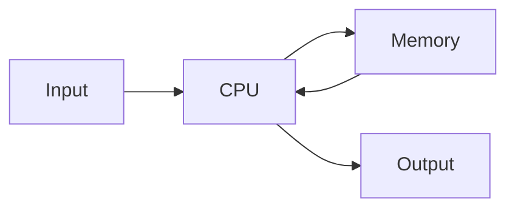
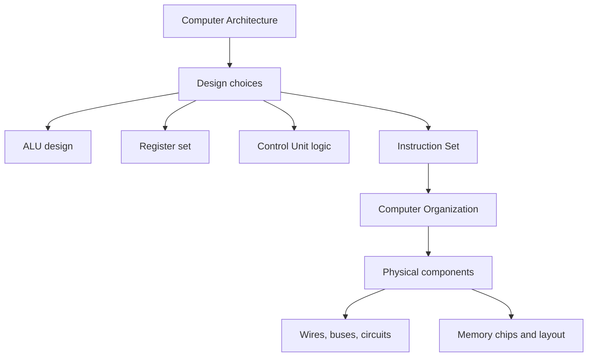
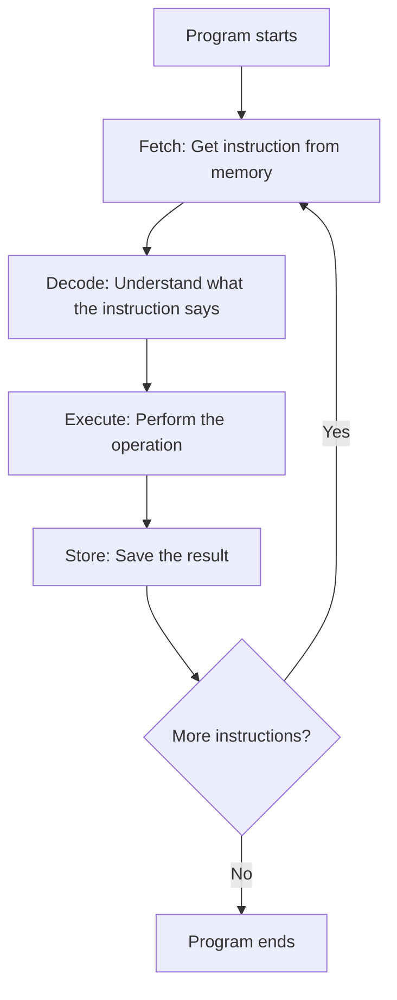
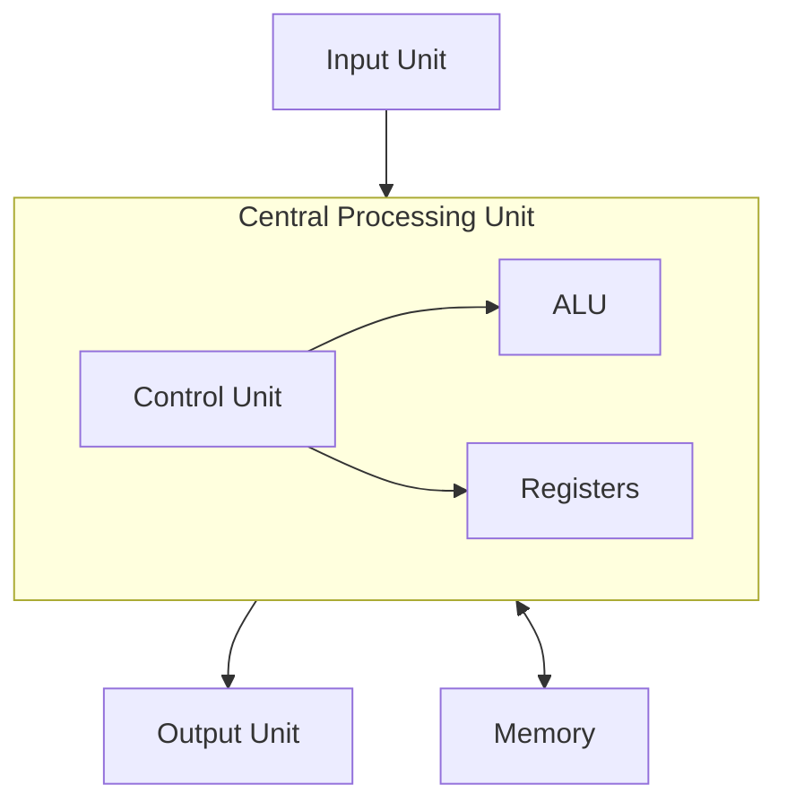
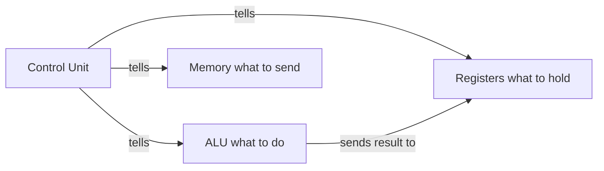
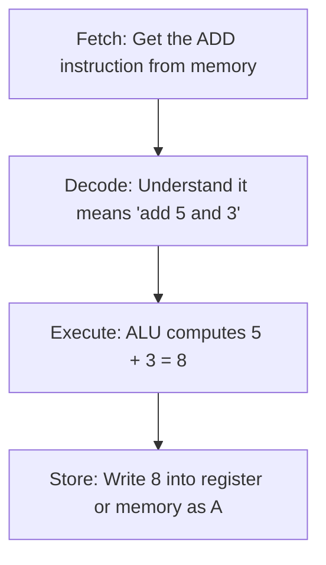

# 1: Introduction to Computer Architecture and Organization

## Why this matters

Every computer, from your phone to a supercomputer, follows the same basic design ideas. Before diving into registers, memory, or instruction sets, you need to understand what a computer actually is and how its parts work together. This is the foundation for everything else in COA.

## Core Concept: What is a Computer?

A computer is a machine that takes input, processes it, stores data, and produces output.

### Simple breakdown
- **Input**: keyboard, mouse, sensors, camera
- **Processing**: CPU does calculations and decision making
- **Storage**: RAM (short term), hard disk/SSD (long term)
- **Output**: screen, speaker, printer

## Architecture vs Organization

This is the single most important distinction in this subject.

| Topic | Meaning | Main Question | Example |
|-------|---------|---------------|---------|
| Computer Architecture | The design and logic of the system | What should the system do? | Instruction set, data types, addressing modes |
| Computer Organization | The physical implementation in hardware | How is it built and connected? | Wires, buses, circuits, memory chips |

### Easy memory trick

Think of building a house:
- **Architecture** = the blueprint (what rooms, how many floors, where the doors go)
- **Organization** = the actual construction (which bricks, what wiring, how thick the walls)

Two houses can share the same blueprint (architecture) but be built with different materials (organization).

## How a Computer Works: The Instruction Cycle

Every computer follows this cycle repeatedly to run programs:

This is called the **Fetch-Decode-Execute cycle**. The processor keeps repeating this loop until there are no more instructions.

## Core Building Blocks of a Computer

### What each block does

| Block | What it does | Real example |
|-------|-------------|--------------|
| Input Unit | Sends data into the computer | Keyboard, mouse, scanner |
| CPU | The brain. Processes all instructions | The processor chip |
| Control Unit | Decides the order of operations | Traffic signal for data flow |
| ALU | Does math and logic operations | Adding two numbers, comparing values |
| Registers | Tiny, ultra fast storage inside the CPU | Holding the current instruction |
| Memory | Stores data and instructions | RAM, hard disk, SSD |
| Output Unit | Sends results to the user | Monitor, printer, speaker |

### Why the CPU needs all these parts

The Control Unit is like a manager. It does not do the actual work, but it tells everyone else when and what to do.

## Key Terms

| Term | Meaning | Example |
|------|---------|---------|
| Architecture | Logical design of a computing system | Instruction set design |
| Organization | Physical implementation of the design | Bus wiring, memory layout |
| CPU | Central Processing Unit, the main processor | Intel i7, Apple M2 |
| ALU | Arithmetic Logic Unit, does math and logic | Adding 5 + 3 |
| Control Unit | Manages the flow of operations | Sequencing fetch-decode-execute |
| Register | Small, fast storage inside the CPU | Program Counter |
| Instruction Cycle | Fetch, Decode, Execute, Store loop | Running every line of a program |
| Bit | The smallest unit of data (0 or 1) | One binary digit |
| Bus | A wire/path that transfers data between parts | Data bus, address bus |

## Example: Running a Simple Addition

Imagine the CPU needs to compute `A = 5 + 3`:

1. The **Control Unit** reads the instruction from memory
2. It **decodes** the instruction and finds out it is an ADD
3. It sends 5 and 3 to the **ALU**
4. The ALU returns 8
5. The result is stored in a **register** or back in **memory**

## Summary

- A computer is a system of parts working together: input, CPU, memory, and output
- Architecture is the logical design (what the system does)
- Organization is the physical build (how the hardware is connected)
- The CPU contains the Control Unit, ALU, and Registers
- Every program runs through the Fetch-Decode-Execute-Store cycle

## Quick Revision

- Architecture = blueprint, Organization = construction
- CPU = Control Unit + ALU + Registers
- Instruction cycle = Fetch, Decode, Execute, Store
- ALU does math and logic, Control Unit manages the flow
- Input goes in, processing happens in CPU, output comes out
