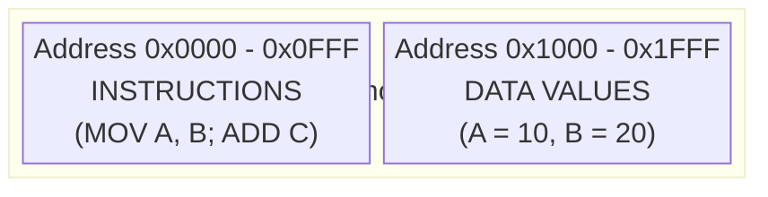
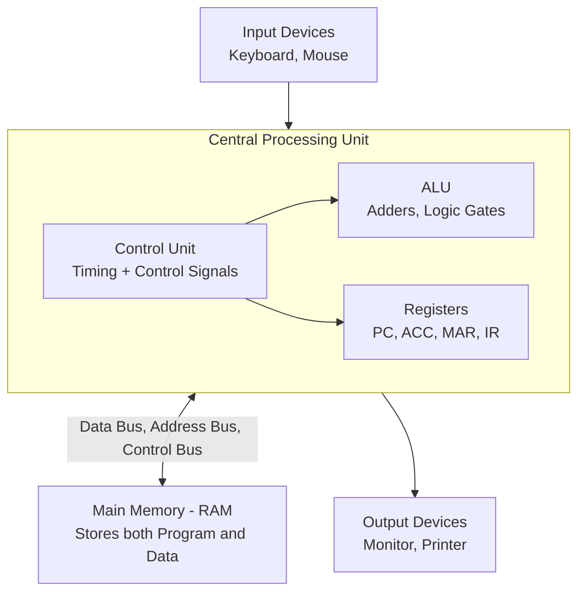
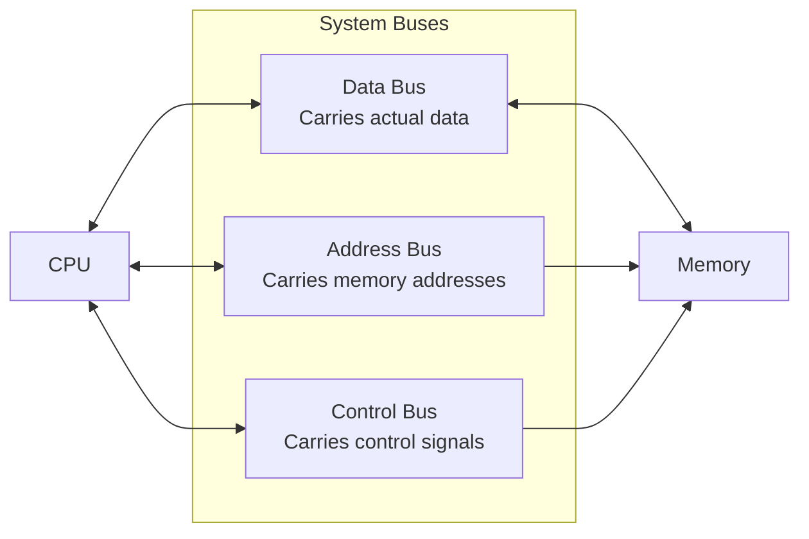
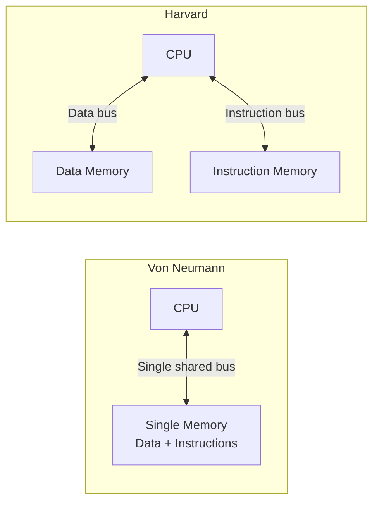
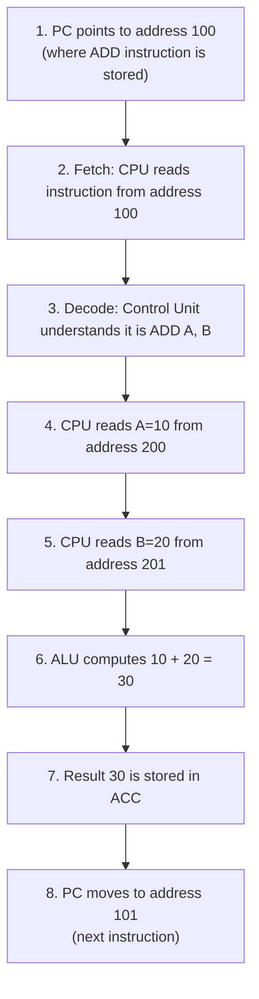

# Video 2: Von Neumann Architecture and Stored Program Concept

## Why this matters

Almost every computer you use today, from laptops to servers, follows the Von Neumann model. Understanding this architecture means understanding the fundamental design of modern computers. Without this, nothing else in COA makes full sense.

## Core Concept: Stored Program Architecture (1945)

**Proposed by**: John von Neumann in 1945

**The big idea**: Both **data** and **program instructions** live in the **same main memory (RAM)**.

Before this, early computers had programs hardwired into them. Changing the program meant physically rewiring the machine. Von Neumann's idea was revolutionary: store the program in memory, just like data.

### What lives in memory

- **Data**: Variables and values used during processing (like `A = 10`, `B = 20`)
- **Instructions**: Commands that tell the CPU what to do (like `ADD`, `SUB`, `MOV`, `JMP`)

Both share the same memory space but sit at different addresses.

### Simple analogy

Think of a notebook where you write both the recipe (instructions) and the ingredients list (data) on the same pages. That notebook is your RAM.

## How it works: The Von Neumann System

### The four main components

**A. Arithmetic and Logic Unit (ALU)**
- Made of digital circuits: adders, subtractors, logic gates, shifters
- Does all the math: addition, subtraction, multiplication, division
- Does all the logic: AND, OR, XOR, bit shifts

**B. Registers (Internal CPU Storage)**
- Small, ultra fast storage locations built directly into the CPU chip
- Made of flip-flops (each flip-flop stores 1 bit)
- Why they exist: The ALU works extremely fast, but main memory is slower in comparison. Registers hold the data the CPU is actively working with, so the ALU does not have to wait for memory every time

Key registers:
| Register | Full Name | What it holds |
|----------|-----------|---------------|
| PC | Program Counter | Address of the next instruction to fetch |
| ACC | Accumulator | Intermediate results from ALU operations |
| MAR | Memory Address Register | Address being sent to memory |
| IR | Instruction Register | The instruction currently being decoded |

**C. Control Unit (CU)**
- The "manager" of the entire system
- Generates two types of signals:

| Signal Type | What it does | Analogy |
|-------------|-------------|---------|
| Timing Signals | Controls the exact sequence of operations | Like driving a manual car: press clutch first, shift gear second, accelerate third. Wrong order = failure |
| Control Signals | Manages read/write access to registers, buses, and memory | Like a traffic controller deciding who goes and who stops |

**D. System Buses and Peripherals**
- **Peripherals**: Input (keyboard, mouse) and output (monitor, printer) devices
- **Buses**: Physical wires that connect all components together

Three types of buses:
- **Data Bus**: Carries the actual data being transferred
- **Address Bus**: Carries the address of where to read or write
- **Control Bus**: Carries signals like "read" or "write"

## Von Neumann vs Harvard Architecture

| Feature | Von Neumann | Harvard |
|---------|------------|---------|
| Memory | Single shared memory for data and instructions | Separate memories for data and instructions |
| Buses | Shared bus for everything | Separate buses for data and instructions |
| Speed | Slower (bus bottleneck, one thing at a time) | Faster (can fetch instruction and data at the same time) |
| Complexity | Simpler to build | More complex, more wires |
| Used in | Most general purpose computers | Microcontrollers, DSPs (Digital Signal Processors) |

### Von Neumann Bottleneck

Since data and instructions share the same bus, the CPU can only do one thing at a time: either fetch an instruction OR fetch data. This limitation is called the **Von Neumann Bottleneck**. Harvard architecture avoids this by using separate paths.

## Key Terms

| Term | Meaning | Example |
|------|---------|---------|
| Stored Program | Both instructions and data are stored in the same memory | Your C program and its variables both live in RAM |
| Von Neumann Architecture | Single memory, single bus design | Most desktop and laptop computers |
| Harvard Architecture | Separate memory and buses for data and instructions | Arduino, some embedded systems |
| Bus | Physical wire path connecting components | Data bus carries numbers between CPU and memory |
| Flip-Flop | A circuit that stores 1 bit | Building block of registers |
| Von Neumann Bottleneck | Speed limit caused by sharing one bus | CPU waiting to fetch data because it is fetching an instruction |

## Example: How a Program Runs in Von Neumann

Imagine a program: `C = A + B` where `A = 10` and `B = 20`

Notice steps 4 and 5: the CPU has to make two separate trips to memory because there is only one bus. In Harvard architecture, it could fetch data and the next instruction at the same time.

## Summary

- Von Neumann architecture stores both data and instructions in the same memory
- The CPU has four main parts: ALU, Registers, Control Unit, and connections via buses
- Three buses connect everything: data bus, address bus, and control bus
- The Control Unit generates timing and control signals to keep everything in order
- The Von Neumann Bottleneck limits speed because data and instructions share one bus
- Harvard architecture solves this with separate memories and buses, but is more complex

## Quick Revision

- Von Neumann = one memory, one bus, data and instructions together
- Harvard = separate memories, separate buses, faster but more complex
- ALU does math, Control Unit manages sequence, Registers hold active data
- Von Neumann Bottleneck = shared bus slows things down
- Registers exist because memory is too slow for the ALU's speed
