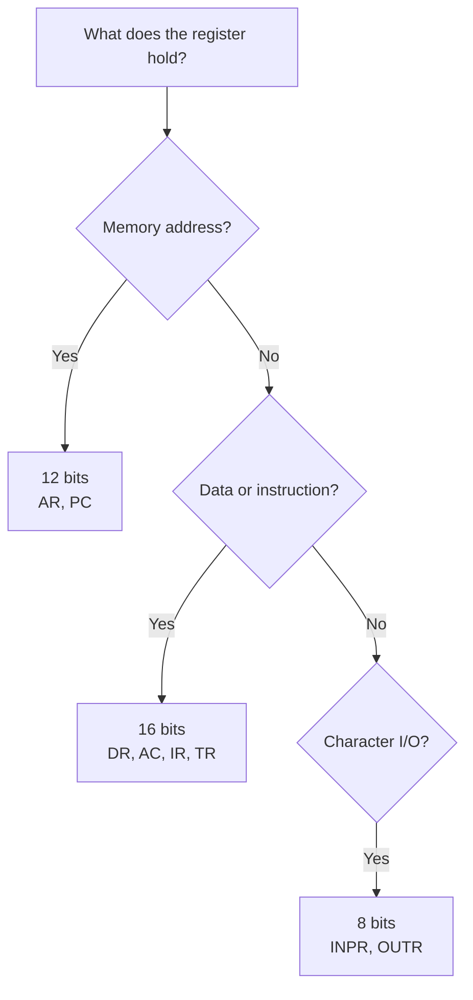
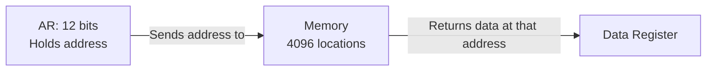
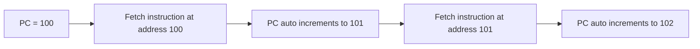
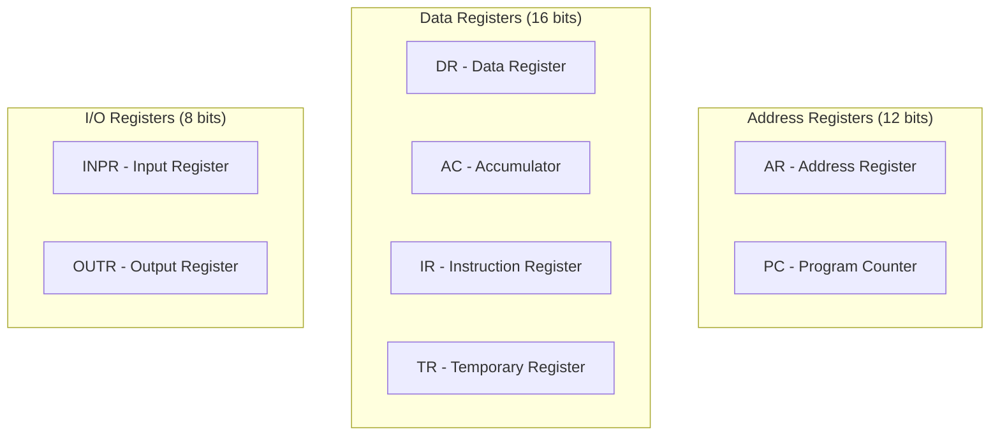
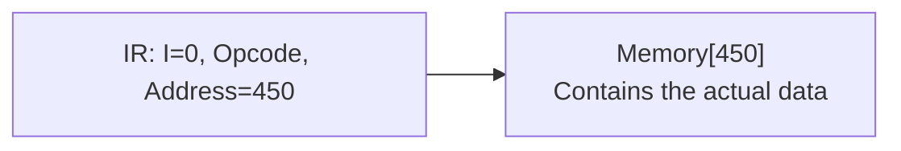
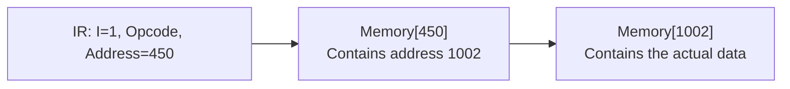
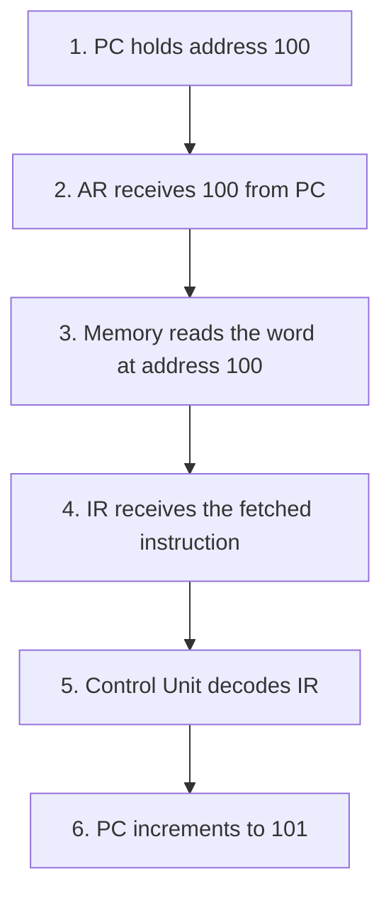

# 3: General Purpose Registers in Computer Architecture

## Why this matters

Registers are the fastest storage in a computer. They sit inside the CPU and hold the data the processor is actively working on right now. Understanding registers is essential because every instruction the CPU runs involves at least one register. The size of each register also determines how the CPU talks to memory.

## Core Concept: Memory Layout and Word Size

Before understanding registers, you need to know how memory is structured.

### Basic Computer Memory Configuration

We use a standard model: **4096 words, each 16 bits wide**

```
Memory size = 4096 x 16
```

Breaking this down:
- **4096 words** = the total number of addressable locations in memory
- **4096 = 2^12**, so you need **12 bits** to represent any address (from 0 to 4095)
- **16 bits per word** = each location stores 16 bits (2 bytes) of data or instruction

### Word vs Byte

| Term | Size | Meaning |
|------|------|---------|
| Bit | 1 bit | Smallest unit, either 0 or 1 |
| Byte | 8 bits | Standard small unit |
| Word | Depends on system | The natural data size of the computer (16-bit, 32-bit, or 64-bit) |

A word is not a fixed size. It changes based on the system. In our basic computer model, one word = 16 bits.

### Visualizing Memory

```
 Address (12 bits)              Data stored at that address (16 bits)
+---------------------+       +------------------------------------+
| 000000000000  (0)   | ----> | bit 15 . . . . . . . . . . bit 0  |
| 000000000001  (1)   | ----> | bit 15 . . . . . . . . . . bit 0  |
|        .            |       |               .                    |
|        .            |       |               .                    |
| 111111111111 (4095) | ----> | bit 15 . . . . . . . . . . bit 0  |
+---------------------+       +------------------------------------+
```

**Key insight**: The address size (12 bits) and the word size (16 bits) determine the size of every register in the CPU.

## How it works: Register Sizing Logic

Every register is either:
- **12 bits wide** if it holds a memory address (because addresses are 12 bits)
- **16 bits wide** if it holds data or instructions (because words are 16 bits)
- **8 bits wide** if it handles character input/output (standard character = 8 bits)



## Detailed Breakdown of Each Register

### A. Address Register (AR) - 12 Bits

- **What it does**: Holds the memory address the CPU wants to access (read from or write to)
- **Why 12 bits**: Memory has 2^12 = 4096 locations, so 12 bits can point to any location



### B. Data Register (DR) - 16 Bits

- **What it does**: Holds data that was just fetched from memory, or data about to be written to memory
- **Why 16 bits**: Each memory word is 16 bits wide, so DR must match that width

### C. Accumulator (AC) - 16 Bits

- **What it does**: The main working register. Stores intermediate results during ALU operations
- **Why 16 bits**: It operates on 16-bit data words
- **Think of it as**: A scratch paper for the ALU to write temporary answers on

### D. Program Counter (PC) - 12 Bits

- **What it does**: Holds the address of the **next instruction** to be fetched
- **Why 12 bits**: It stores a memory address
- **Auto increment**: After fetching the instruction at address N, PC automatically becomes N+1



### E. Instruction Register (IR) - 16 Bits

- **What it does**: Holds the instruction that was just fetched from memory
- **Why 16 bits**: Instructions are stored as 16-bit words

The 16 bits of IR are split into three fields:

```
+------+----------+------------------------+
| Bit 15 | Bits 14-12 | Bits 11-0           |
| I bit  | Opcode     | Address field        |
| 1 bit  | 3 bits     | 12 bits              |
+------+----------+------------------------+
```

| Field | Bits | What it means |
|-------|------|---------------|
| I (Addressing mode) | Bit 15 | 0 = Direct addressing, 1 = Indirect addressing |
| Opcode | Bits 14 to 12 | Operation code (ADD, SUB, AND, etc.) |
| Address | Bits 11 to 0 | Memory address of the operand (12 bits) |

### F. Temporary Register (TR) - 16 Bits

- **What it does**: Scratch space for the CPU during complex operations and register transfers
- **Why 16 bits**: Matches the data word size

### G. Input Register (INPR) and Output Register (OUTR) - 8 Bits each

- **INPR**: Holds an 8-bit character received from an input device (like a keyboard) before it moves to the Accumulator
- **OUTR**: Holds an 8-bit character to be sent to an output device (like a monitor or printer)
- **Why 8 bits**: Standard character encoding uses 8 bits


## Register Summary Table

| Symbol | Full Name | Bits | What it holds |
|--------|-----------|------|---------------|
| AR | Address Register | 12 | Memory address to access |
| DR | Data Register | 16 | Data read from or written to memory |
| AC | Accumulator | 16 | Intermediate ALU results |
| PC | Program Counter | 12 | Address of the next instruction |
| IR | Instruction Register | 16 | Currently fetched instruction |
| TR | Temporary Register | 16 | Temporary data during execution |
| INPR | Input Register | 8 | Character from input device |
| OUTR | Output Register | 8 | Character to output device |

### Visual: All registers and their sizes



## Preview: Direct vs Indirect Addressing

The I bit (bit 15) in the Instruction Register controls how the address field is used:

### Direct Addressing (I = 0)

The address field points directly to the location in memory where the data is.



### Indirect Addressing (I = 1)

The address field points to a memory location that contains another address (a pointer). The CPU has to make two trips to memory.



### Comparison

| Mode | I bit | How address is used | Memory accesses needed |
|------|-------|--------------------|-----------------------|
| Direct | 0 | Address field = location of data | 1 |
| Indirect | 1 | Address field = location of a pointer to data | 2 |

## Key Terms

| Term | Meaning | Example |
|------|---------|---------|
| Register | Small, fast storage inside the CPU | Accumulator, Program Counter |
| Word | The natural data size of a computer system | 16 bits in our basic computer |
| Opcode | Operation code, tells CPU what to do | ADD = 001, SUB = 010 |
| Operand | The data an instruction acts on | The address or value being added |
| Direct addressing | Address field directly gives data location | Go to address 450, get the data |
| Indirect addressing | Address field gives location of a pointer | Go to 450, find address 1002, then get data from 1002 |
| Flip-flop | A circuit that stores 1 bit | Registers are built from chains of flip-flops |

## Example: Fetching an Instruction

Watch how multiple registers work together during one fetch:



Step by step:
1. **PC** says "the next instruction is at address 100"
2. That address is copied into **AR** (because AR talks to memory)
3. Memory sends back the 16-bit word stored at address 100
4. That word goes into **IR** (because IR holds the current instruction)
5. The Control Unit reads IR and figures out the opcode and operand
6. **PC** automatically moves to 101, ready for the next fetch

## Summary

- Registers are the fastest storage in a computer, built into the CPU itself
- Register size depends on what they hold: 12 bits for addresses, 16 bits for data, 8 bits for characters
- The Program Counter (PC) always points to the next instruction and auto increments
- The Instruction Register (IR) splits into three fields: I bit, opcode, and address
- Direct addressing reads data in one memory access, indirect addressing needs two

## Quick Revision

- AR and PC are 12 bits because memory addresses are 12 bits (2^12 = 4096)
- DR, AC, IR, TR are 16 bits because data words are 16 bits
- INPR and OUTR are 8 bits because they handle characters
- PC auto increments after every fetch
- IR format: 1 bit I + 3 bits opcode + 12 bits address = 16 bits total