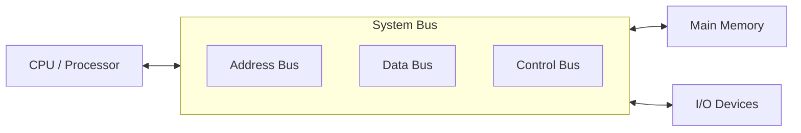
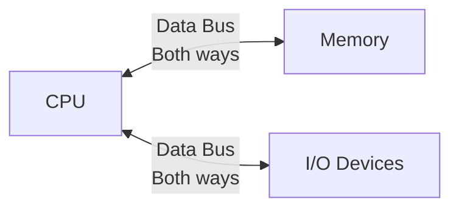
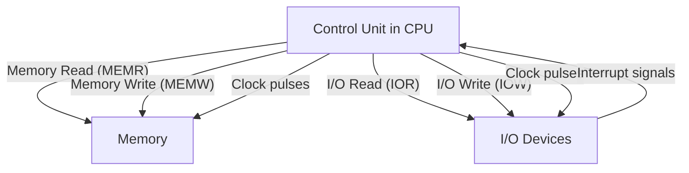
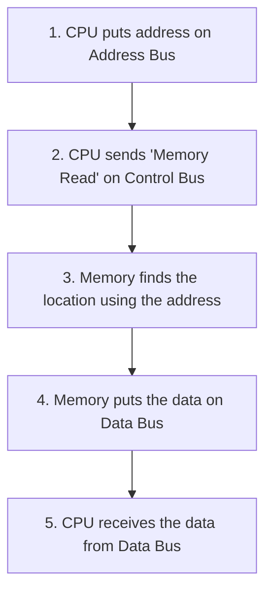
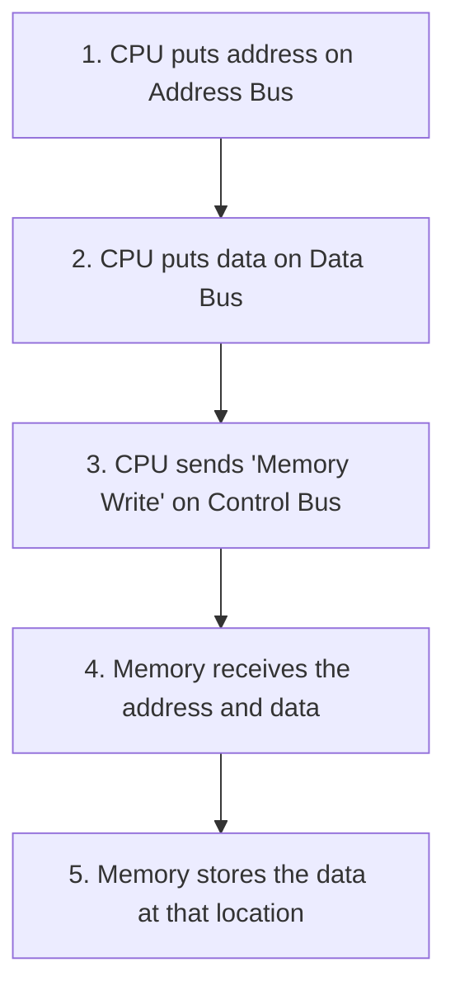

# Video 4: Types of System Buses (Address, Data, and Control)

## Why this matters

Every part of a computer (CPU, memory, I/O devices) needs to communicate with every other part. Buses are the highways that make this communication possible. Without understanding buses, you cannot understand how data actually moves through a computer.

## Core Concept: What is a System Bus?

A **bus** is a shared group of physical wires that connects the CPU, main memory, and I/O devices. Buses carry signal bits between these components.

There are three types of buses, classified by what they carry:



| Bus | What it carries | Direction |
|-----|----------------|-----------|
| Address Bus | Memory addresses | One way (CPU to Memory/IO) |
| Data Bus | Actual data and instructions | Both ways |
| Control Bus | Command and timing signals | Both ways |

## How it works: The Three Bus Types

### A. Address Bus

**What it does**: Carries memory addresses from the CPU to memory or I/O devices. It tells the system "which location" to read from or write to.

**Direction**: Strictly **unidirectional** (one way). The CPU sends addresses out. Memory and I/O devices never send addresses back to the CPU.

**Bus width and memory capacity**: The number of address lines determines how many memory locations the system can access.

```
Total memory locations = 2^k
(where k = number of address bus lines)
```

**Examples**:
- 8085 microprocessor has a 16-bit address bus: `2^16 = 65,536 memory locations`
- A 3-bit address bus: `2^3 = 8 memory locations` (addresses 000 to 111)
- A 12-bit address bus: `2^12 = 4,096 memory locations` (like our basic computer from Video 3)


**MSB padding rule**: If the address is smaller than the bus width, the extra high bits are filled with zeros. For example, sending address `101` (binary for 5) over a 16-bit bus becomes `0000000000000101`.

```
Address Bus (3-bit example):
Bit 2 (MSB) = 1
Bit 1       = 0  --> Selects memory slot 5 (binary 101)
Bit 0 (LSB) = 1
```

---

### B. Data Bus

**What it does**: Transfers actual data, instruction opcodes, and operands between the CPU, memory, and I/O devices.

**Direction**: **Bidirectional** (both ways).
- Data flows **into** the CPU when fetching instructions or reading input
- Data flows **out of** the CPU when writing results to memory or sending output



**Bus width and word size**: The data bus width matches the system's word size (the width of one memory location).
- If memory stores 16-bit words, the data bus is 16 bits wide
- If memory stores 32-bit words, the data bus is 32 bits wide

**Small data padding**: If the data being sent is smaller than the bus width (for example, an 8-bit character on a 16-bit bus), the data sits in the lower bits and the upper bits are padded with zeros.

---

### C. Control Bus

**What it does**: Carries command signals and timing pulses from the CPU's Control Unit to coordinate all system operations.

**Direction**: Multi-directional. The CPU sends commands out, and devices send back status and interrupt signals.



**Key signals carried by the control bus**:

| Signal | What it does |
|--------|-------------|
| Memory Read (MEMR) | Tells memory to send data to the CPU |
| Memory Write (MEMW) | Tells memory to accept data from the CPU |
| I/O Read (IOR) | Tells an input device to send data |
| I/O Write (IOW) | Tells an output device to accept data |
| Clock pulses | Timing signals for step-by-step execution |
| Interrupt | Device tells CPU it needs attention |

## Putting it all together

Here is how all three buses work during a memory read operation:



And during a memory write operation:



## Key Terms

| Term | Meaning | Example |
|------|---------|---------|
| Bus | A group of wires that carry signals between components | Address bus, data bus |
| Address Bus | Carries memory addresses from CPU to memory | 16-bit bus can address 65,536 locations |
| Data Bus | Carries actual data between CPU, memory, and I/O | 16-bit bus transfers one word at a time |
| Control Bus | Carries command and timing signals | MEMR, MEMW, clock pulses |
| Unidirectional | Signal flows in one direction only | Address bus (CPU to memory only) |
| Bidirectional | Signal flows in both directions | Data bus (CPU to memory and back) |
| Word size | Natural data width of the system | 16-bit, 32-bit, 64-bit |
| Bus width | Number of lines (wires) in a bus | 16 address lines = 16-bit address bus |
| MSB padding | Filling unused high bits with zeros | Address 101 on 16-bit bus becomes 0000000000000101 |

## Example: Address Bus Width Calculation

**Question**: A system has a 20-bit address bus. How many memory locations can it address?

**Solution**:
```
Total locations = 2^k = 2^20 = 1,048,576 locations = 1 MB
```

**Question**: A system needs to address 4096 memory locations. How many address bus lines are needed?

**Solution**:
```
2^k = 4096
k = 12 (because 2^12 = 4096)
Answer: 12 address bus lines
```

## Summary Table

| Feature | Address Bus | Data Bus | Control Bus |
|---------|------------|----------|-------------|
| Carries | Memory/IO addresses | Actual data and instructions | Command and timing signals |
| Direction | Unidirectional (CPU to Memory/IO) | Bidirectional (both ways) | Multi-directional |
| Width decided by | Number of memory locations (2^k) | Word size (8, 16, 32 bits) | Number of control signals needed |
| Example | 16-bit address for location 5 | 16-bit data word | Memory Read, Clock pulse |

## Summary

- A system bus is a group of wires connecting CPU, memory, and I/O devices
- There are three bus types: address (where), data (what), and control (how)
- Address bus is one-way (CPU sends addresses out), data bus is two-way
- Address bus width determines how many memory locations the system can access (2^k)
- Data bus width matches the word size of the system
- Control bus carries signals like MEMR, MEMW, IOR, IOW, and clock pulses

## Quick Revision

- Address bus = unidirectional, carries addresses, width decides memory capacity (2^k)
- Data bus = bidirectional, carries actual data, width matches word size
- Control bus = multi-directional, carries MEMR/MEMW/IOR/IOW and clock signals
- 16-bit address bus = 2^16 = 65,536 addressable locations
- All three buses work together for every read/write operation
