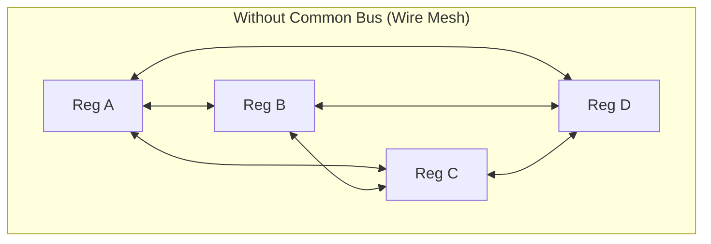
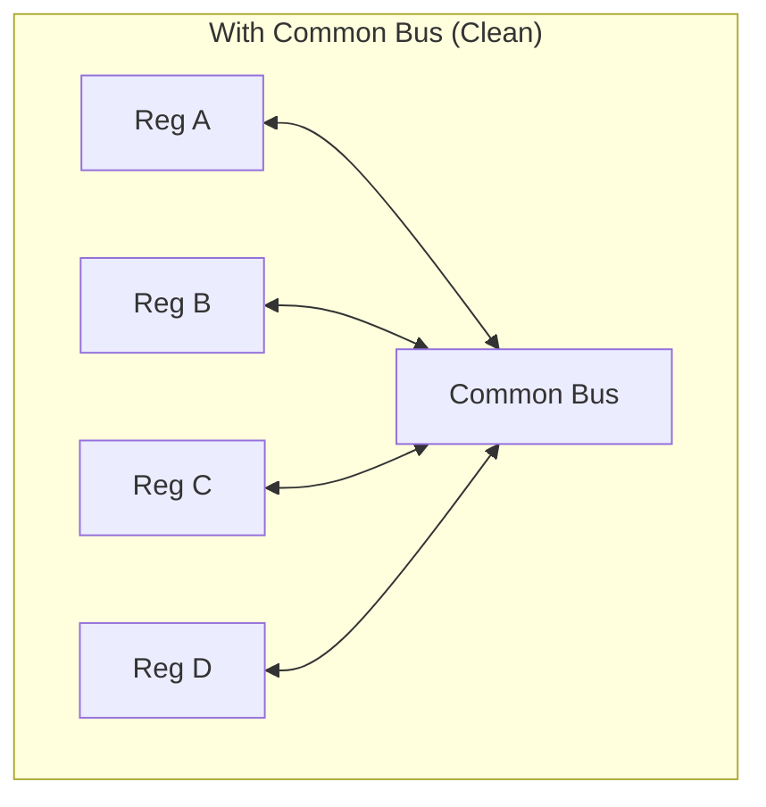
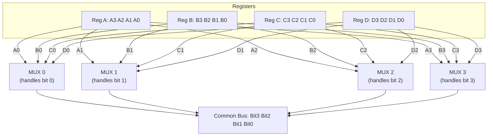
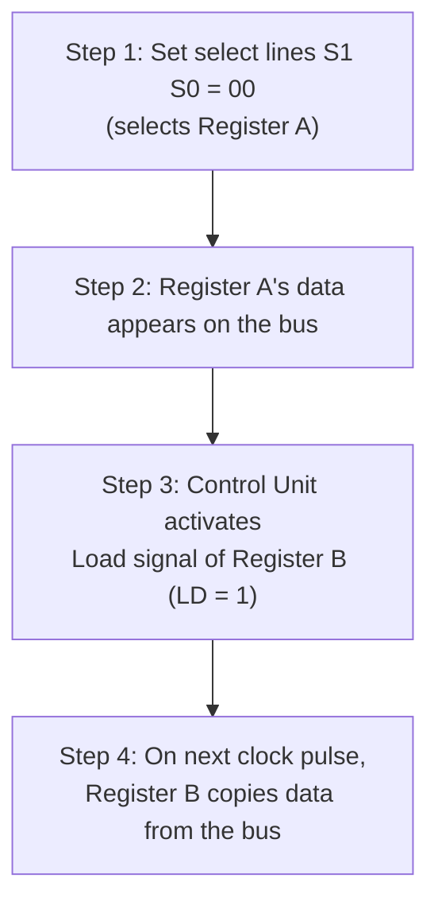

# Video 5: Common Bus System Using Multiplexers

## Why this matters

In the previous video, you learned about the three types of buses. But how do multiple registers actually share one bus? If every register had a direct wire to every other register, the wiring would be a nightmare. The common bus system uses **multiplexers** to solve this problem. This is how real CPUs route data between registers efficiently.

## Core Concept: Why a Common Bus?

**The problem**: A CPU has many registers (PC, AC, DR, AR, IR, TR). Each register may need to send data to any other register. Connecting every register directly to every other register creates a "wire mesh" that is expensive and complex.

**The solution**: Use a **common bus**, a single shared path. Only one register puts its data on the bus at a time, and any other register can read from it.

The common bus approach needs far fewer wires.

## How it works: Multiplexer-Based Bus

### The setup

To explain this, we use a simple model:
- **4 registers** (A, B, C, D), each **4 bits** wide
- **4 multiplexers** (one per bit position): MUX 0, MUX 1, MUX 2, MUX 3
- **2 select lines** (S1, S0) because `2^2 = 4` inputs per MUX

### Connection logic

Each MUX handles one bit position across all registers:

**How it works**: MUX 0 takes bit 0 from all four registers. Based on the select lines, it picks one and puts it on the bus. Same for MUX 1, MUX 2, and MUX 3. Together, all four MUXes output one complete 4-bit word onto the bus.

### Register selection truth table

The select lines (S1, S0) control which register's data appears on the bus:

| S1 | S0 | MUX Input | Register Selected | Data on Bus |
|----|-----|-----------|-------------------|-------------|
| 0 | 0 | Input 0 | Register A | A3, A2, A1, A0 |
| 0 | 1 | Input 1 | Register B | B3, B2, B1, B0 |
| 1 | 0 | Input 2 | Register C | C3, C2, C1, C0 |
| 1 | 1 | Input 3 | Register D | D3, D2, D1, D0 |

## How Register-to-Register Transfer Works

To transfer data from **Register A** to **Register B**:

Key points:
- The **select lines** decide which register puts data ON the bus
- The **Load signal** decides which register reads data FROM the bus
- Only one register can output to the bus at a time, but any register can load from it

## Formulas for Exams

If a system has **K registers**, each **n bits** wide:

| Formula | Value | Meaning |
|---------|-------|---------|
| Number of MUXes | n (the bit width) | One MUX per bit position |
| MUX size | K x 1 | K inputs (one from each register), 1 output |
| Select lines per MUX | ceil(log2(K)) | Enough bits to choose from K inputs |

### Example 1
**System**: 8 registers, each 16 bits wide
- Number of MUXes = 16 (one per bit)
- MUX size = 8 x 1
- Select lines = log2(8) = 3 lines

### Example 2
**System**: 16 registers, each 32 bits wide
- Number of MUXes = 32 (one per bit)
- MUX size = 16 x 1
- Select lines = log2(16) = 4 lines

## Key Terms

| Term | Meaning | Example |
|------|---------|---------|
| Common bus | A single shared data path between components | 16-bit bus connecting all registers |
| Multiplexer (MUX) | A circuit that selects one of many inputs | 4x1 MUX picks one of 4 register bits |
| Select lines | Control inputs that choose which data to pass | S1, S0 = 01 selects Register B |
| Load signal (LD) | Control input that tells a register to accept bus data | LD of Register B = 1 |
| Wire mesh | Direct wiring between every pair, complex and costly | The problem the bus solves |

## Summary

- A common bus system replaces complex point-to-point wiring with a single shared path
- Multiplexers select which register puts its data on the bus
- One MUX is needed per bit position (n-bit registers need n MUXes)
- Select lines choose the source register, Load signal chooses the destination
- Only one register can write to the bus at a time, but any register can read from it

## Quick Revision

- Common bus = shared path, reduces wires, uses MUXes
- Number of MUXes = number of bits per register
- MUX size = K x 1 (K = number of registers)
- Select lines = log2(K) per MUX
- Transfer: set select lines (source) + activate Load (destination) + clock pulse
