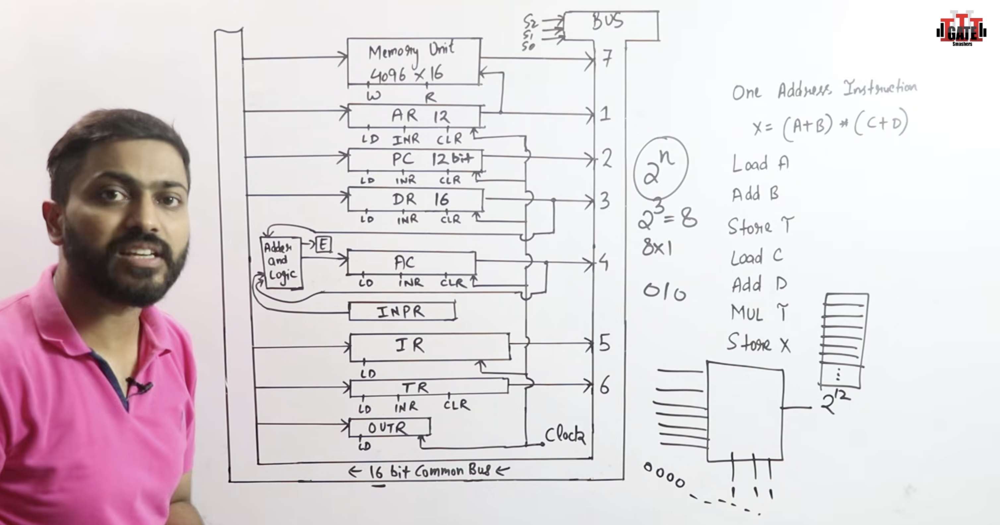
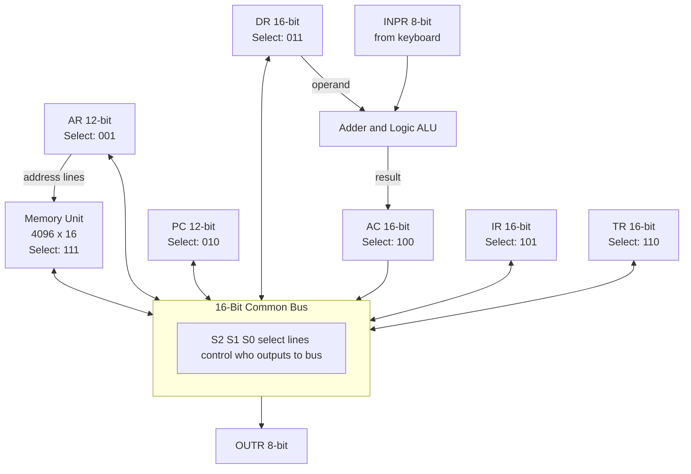
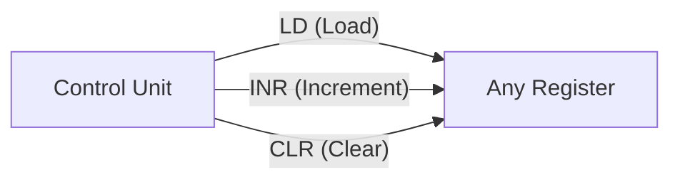
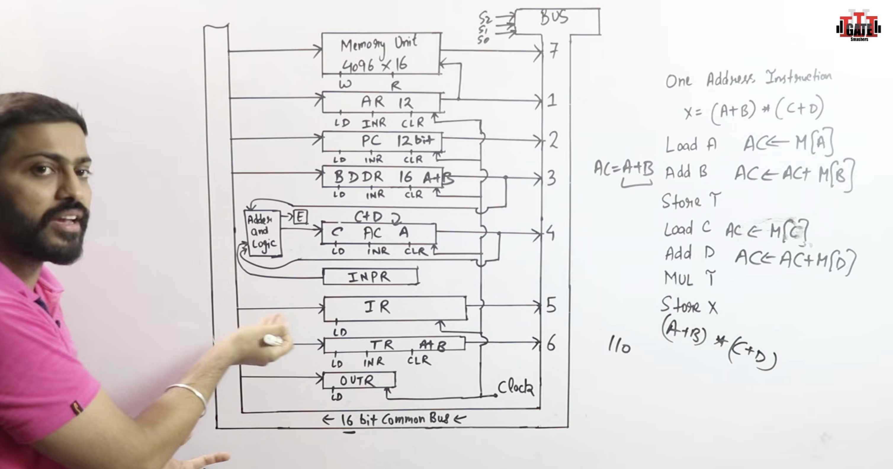
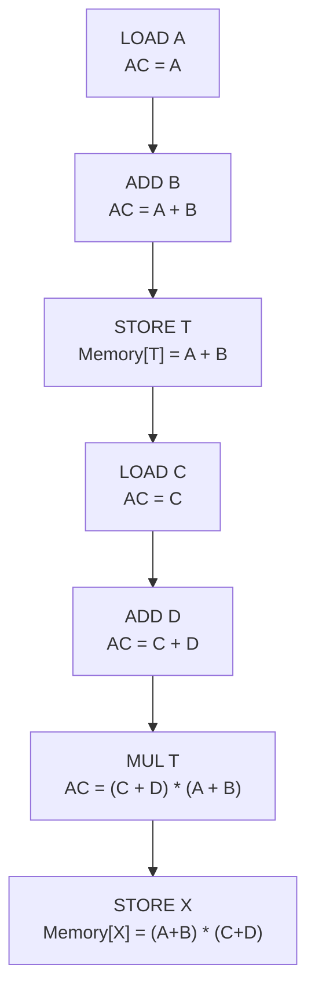
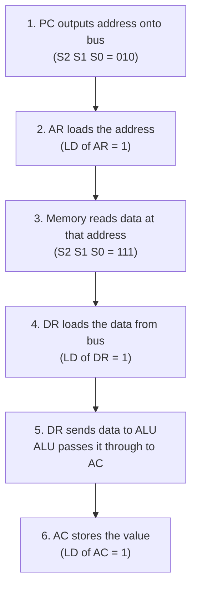

# Video 6: Basic Computer Architecture and Common Bus in Action

## Why this matters

In Video 5 you learned how multiplexers create a common bus. Now it is time to see the complete picture: how all the registers, memory, ALU, and the common bus connect to form a working basic computer. This is the architecture diagram you will see in every COA textbook and exam.

## Reference Diagram

The diagram below (from the lecture) shows the full 16-bit common bus system with all registers, memory, ALU, and I/O connections:

## Core Concept: The Basic Computer Architecture

The basic computer has these components connected through a **16-bit common bus**:

- **Memory Unit**: 4096 x 16 bits (4096 locations, each 16 bits wide)
- **7 Registers**: AR, PC, DR, AC, IR, TR, OUTR
- **2 I/O Registers**: INPR (input), OUTR (output)
- **Adder and Logic circuit (ALU)**: Connected to AC and DR
- **Bus selection**: Controlled by 3 select lines (S2, S1, S0)

### Memory configuration reminder
- 4096 locations = 2^12, so addresses need 12 bits
- Each word is 16 bits wide, so the bus is 16 bits wide
- When a 12-bit register (AR or PC) puts data on the 16-bit bus, the top 4 bits are padded with zeros

## Bus Select Lines: Who Gets to Talk?

The 3 select lines (S2, S1, S0) decide which component puts its data onto the bus. Think of it as a "who speaks now?" switch.

| S2 | S1 | S0 | Code | Component on Bus |
|----|----|----|------|------------------|
| 0 | 0 | 0 | 000 | None (bus is empty) |
| 0 | 0 | 1 | 001 | AR (Address Register) |
| 0 | 1 | 0 | 010 | PC (Program Counter) |
| 0 | 1 | 1 | 011 | DR (Data Register) |
| 1 | 0 | 0 | 100 | AC (Accumulator) |
| 1 | 0 | 1 | 101 | IR (Instruction Register) |
| 1 | 1 | 0 | 110 | TR (Temporary Register) |
| 1 | 1 | 1 | 111 | Memory (RAM read) |

**Why 3 select lines?** We have 7 sources (+ 1 "none" state) = 8 options. 2^3 = 8, so 3 lines are enough.

## Register Control Signals

Every register has three hardware control inputs from the Control Unit:

| Signal | What it does | Example |
|--------|-------------|---------|
| LD (Load) | Register accepts data from the bus | DR loads data from memory via bus |
| INR (Increment) | Register value goes up by 1 | PC increments after each fetch |
| CLR (Clear) | Register resets to all zeros | AC cleared before a new operation |

## Register and Component Summary

| Symbol | Name | Bits | Bus Select Code | Connection Notes |
|--------|------|------|-----------------|------------------|
| AR | Address Register | 12 | 001 | Outputs address directly to memory |
| PC | Program Counter | 12 | 010 | Sends/receives via bus |
| DR | Data Register | 16 | 011 | Sends data to bus AND to ALU |
| AC | Accumulator | 16 | 100 | Receives from ALU, sends to bus |
| IR | Instruction Register | 16 | 101 | Sends/receives via bus |
| TR | Temporary Register | 16 | 110 | Sends/receives via bus |
| INPR | Input Register | 8 | - | Sends to ALU directly (not through bus) |
| OUTR | Output Register | 8 | - | Receives from bus, sends to display |
| Memory | RAM | 4096 x 16 | 111 | Receives address from AR, data via bus |

### Important connections that bypass the bus
- **INPR** does not go through the bus. It feeds directly into the ALU (Adder and Logic)
- **AR** has a direct line to the memory address input (in addition to bus connection)
- **AC** receives data only from the ALU output, not directly from the bus
- **The ALU** takes inputs from DR and AC, and its output goes to AC through the E (extended) bit

## Real Execution Example: Computing X = (A + B) * (C + D)

This is a one-address instruction sequence. The Accumulator (AC) is always one operand. The instruction specifies the memory address of the other operand.

### The instruction sequence

| Step | Instruction | What happens | Register Transfer |
|------|------------|-------------|-------------------|
| 1 | LOAD A | Load value of A from memory into AC | AC <-- M[A] |
| 2 | ADD B | Add value of B from memory to AC | AC <-- AC + M[B] |
| 3 | STORE T | Save (A + B) from AC to memory location T | M[T] <-- AC |
| 4 | LOAD C | Load value of C from memory into AC | AC <-- M[C] |
| 5 | ADD D | Add value of D from memory to AC | AC <-- AC + M[D] |
| 6 | MUL T | Multiply AC by value at T | AC <-- AC * M[T] |
| 7 | STORE X | Save final result to memory location X | M[X] <-- AC |

### Step-by-step data flow

### Detailed bus operations for LOAD A

### Why STORE T is needed

The basic computer has only **one accumulator**. After computing `A + B`, we need AC free to compute `C + D`. So we save `A + B` to a temporary memory location T. After computing `C + D` in AC, we can multiply by the saved value at T.

## Key Terms

| Term | Meaning | Example |
|------|---------|---------|
| Common bus system | Shared 16-bit path connecting all components | The bus in the basic computer |
| Select lines (S2 S1 S0) | 3-bit code choosing which component outputs to bus | 100 = AC outputs to bus |
| Load (LD) | Signal that makes a register accept data from bus | LD of DR = 1 during memory read |
| Increment (INR) | Signal that adds 1 to a register | PC increments after fetch |
| Clear (CLR) | Signal that resets a register to 0 | CLR of AC before new operation |
| One-address instruction | Instruction format where AC is always one operand | ADD B means AC = AC + M[B] |
| E bit (Extended bit) | Extra bit at ALU output for carry/overflow | Holds carry from 16-bit addition |
| Register transfer | Moving data from one register to another via bus | AC <-- M[A] |

## Summary

- The basic computer connects all registers and memory through a 16-bit common bus
- 3 select lines (S2, S1, S0) choose which component outputs to the bus (8 options)
- Each register has LD, INR, and CLR control signals from the Control Unit
- AC receives data only from the ALU, not directly from the bus
- INPR feeds directly into the ALU, bypassing the bus
- One-address instructions use AC as an implicit operand
- Complex expressions like (A+B)*(C+D) need temporary storage because there is only one accumulator

## Quick Revision

- Bus select 001=AR, 010=PC, 011=DR, 100=AC, 101=IR, 110=TR, 111=Memory
- Each register has 3 control signals: LD (load), INR (increment), CLR (clear)
- AC gets data from ALU only, not directly from bus
- INPR connects directly to ALU, not through bus
- One-address instruction: AC is always one operand, instruction gives memory address of the other
- To compute (A+B)*(C+D): LOAD A, ADD B, STORE T, LOAD C, ADD D, MUL T, STORE X
