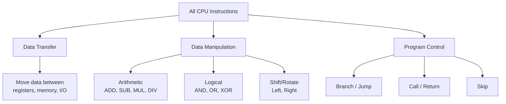
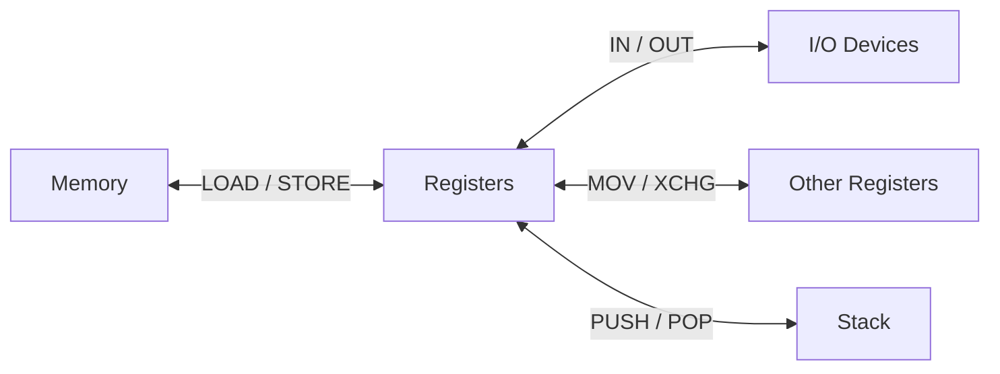
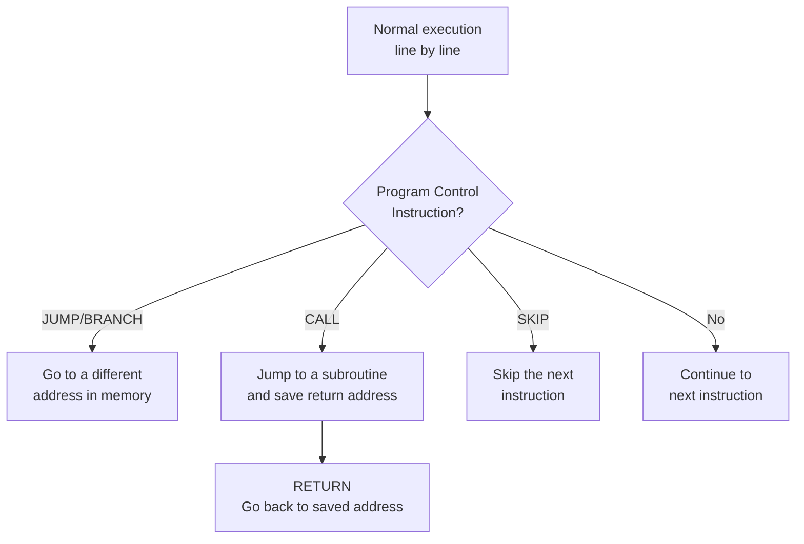
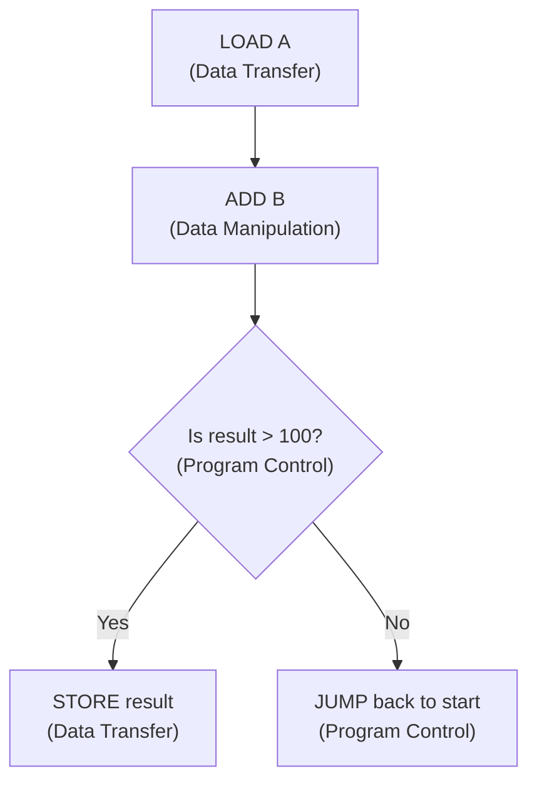

# Video 7: Types of Instructions in a General Purpose Computer

## Why this matters

Every program you write eventually becomes a sequence of instructions that the CPU executes. Understanding the three types of instructions tells you everything a CPU can actually do. Every single instruction, no matter how complex the program, falls into one of these three categories.

## Core Concept: What is an Instruction?

An **instruction** is a command given to the processor telling it what operation to perform and how to execute it.

All instructions in a general purpose computer (x86, AMD, Intel, ARM) fall into three categories:

## The Three Instruction Types

### A. Data Transfer Instructions

**What they do**: Copy or move data from one place to another without changing the data itself.

Data can move between:
- Register to register
- Register to memory
- Memory to register
- CPU to I/O device
- I/O device to CPU

**Key commands**: `LOAD`, `STORE`, `MOV`, `XCHG`, `PUSH`, `POP`, `IN`, `OUT`

### B. Data Manipulation Instructions

**What they do**: Change, process, or transform data. This is where actual computation happens.

Three sub-categories:

| Sub-category | What it does | Examples |
|-------------|-------------|---------|
| Arithmetic | Math operations on numbers | ADD, SUB, MUL, DIV, INC, DEC |
| Logical | Bitwise operations | AND, OR, XOR, Complement, Clear |
| Shift/Rotate | Move bits left or right within a register | Logical Shift, Arithmetic Shift, Rotate |

### C. Program Control Instructions

**What they do**: Change the order of execution. Without these, a program would only run top to bottom with no decisions or loops.

**Key commands**: `BRANCH`, `JUMP`, `SKIP`, `CALL`, `RETURN`

These are what make `if`, `for`, `while`, and function calls possible at the hardware level.

## How They Work Together

A real program uses all three types. Here is a simple example:

## Key Terms

| Term | Meaning | Example |
|------|---------|---------|
| Data Transfer | Move data without changing it | LOAD, STORE, MOV |
| Data Manipulation | Change or process data | ADD, AND, Shift Left |
| Program Control | Change execution order | JUMP, CALL, RETURN |
| Arithmetic instruction | Math on numbers | ADD, SUB, MUL, DIV |
| Logical instruction | Bitwise operations | AND, OR, XOR |
| Shift instruction | Move bits within a register | Shift Left, Rotate Right |
| Branch/Jump | Go to a different instruction address | JUMP 200, BRANCH IF ZERO |
| Subroutine | A reusable block of instructions | CALL function, RETURN |

## Summary

- Every CPU instruction falls into one of three types: data transfer, data manipulation, or program control
- Data transfer moves data between registers, memory, and I/O without changing it
- Data manipulation includes arithmetic (ADD, SUB), logical (AND, OR), and shift operations
- Program control changes the execution flow with jumps, branches, calls, and returns
- Real programs combine all three types to do useful work

## Quick Revision

- Data Transfer = LOAD, STORE, MOV, PUSH, POP, IN, OUT (moves data, does not change it)
- Data Manipulation = Arithmetic + Logical + Shift (changes data)
- Program Control = JUMP, BRANCH, CALL, RETURN, SKIP (changes execution order)
- Without program control, there are no loops or if-else decisions
- All three types work together in every real program
