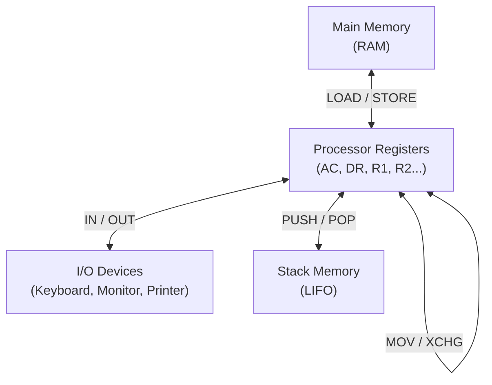
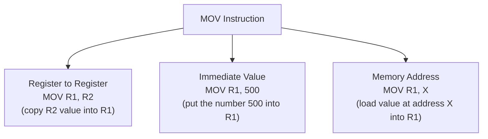
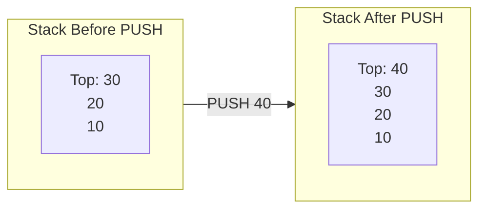
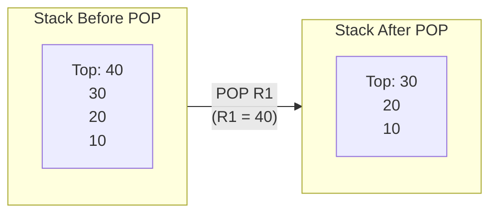
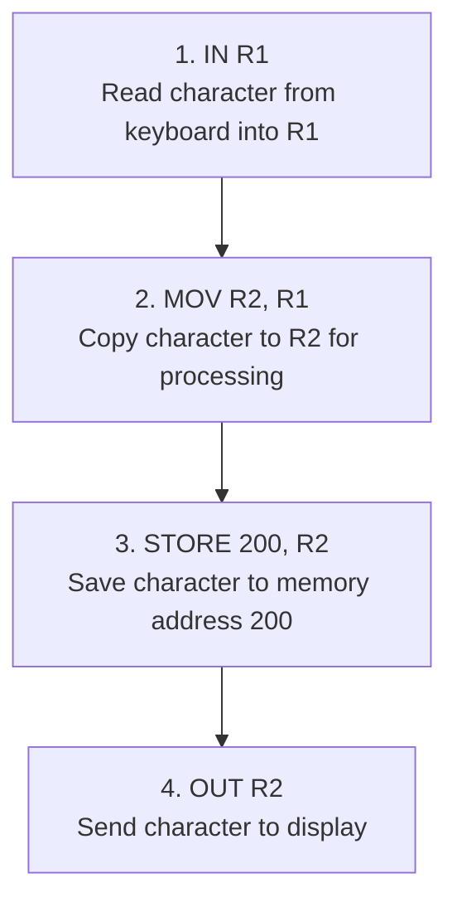

# Video 8: Data Transfer Instructions

## Why this matters

Data transfer instructions are the most frequently used instructions in any program. Before the CPU can add, compare, or process anything, the data must first be moved to the right place. These instructions handle all movement of data between memory, registers, I/O devices, and the stack.

## Core Concept: Where Does Data Move?

Data transfer instructions copy data between three locations:

**Important**: Data transfer instructions **copy** data. They do not change or process it. The value stays the same, it just appears in a new location.

## How it works: All Data Transfer Instructions

| Instruction | Full Name | What it does | Example |
|-------------|-----------|-------------|---------|
| MOV | Move / Copy | Copies data from source to destination | `MOV R1, R2` (copy R2 into R1) |
| LOAD (LD) | Load from Memory | Copies a word from memory into a register | `LOAD R1, 500` (load value at address 500 into R1) |
| STORE (STA) | Store to Memory | Copies a word from a register into memory | `STA 500, R1` (store R1 value at address 500) |
| XCHG | Exchange / Swap | Swaps values between two registers | `XCHG R1, R2` (R1 and R2 swap their values) |
| IN | Input | Reads data from an input device into a register | `IN R1` (read keyboard input into R1) |
| OUT | Output | Sends data from a register to an output device | `OUT R1` (send R1 value to display) |
| PUSH | Push to Stack | Puts a value on top of the stack | `PUSH R1` (R1 value goes to top of stack) |
| POP | Pop from Stack | Takes the top value from the stack | `POP R1` (top of stack goes into R1) |
| SET | Set Bit | Writes 1 to a specific register bit | `SET R1` (set a bit to 1) |
| CLR | Clear | Writes 0 to clear a register or bit | `CLR R1` (reset register to 0) |

## MOV Instruction: Three Addressing Modes

The MOV instruction is the most flexible. It supports multiple ways to specify the source:

| Mode | Syntax | What happens |
|------|--------|-------------|
| Register | `MOV R1, R2` | R1 gets a copy of R2's value |
| Immediate | `MOV R1, 500` | R1 gets the number 500 directly |
| Direct | `MOV R1, X` | R1 gets the value stored at memory address X |

## PUSH and POP: Stack Operations

The stack is a Last-In-First-Out (LIFO) data structure in memory. Think of it as a stack of plates: you can only add or remove from the top.

## Example: Moving Data Through the System

Imagine reading a character from the keyboard and displaying it on screen:

Every step here is a data transfer instruction. The character value itself never changes, it just moves to different locations.

## Key Terms

| Term | Meaning | Example |
|------|---------|---------|
| Data transfer | Moving data without changing it | LOAD, STORE, MOV |
| LOAD | Copy from memory to register | LOAD R1, address |
| STORE | Copy from register to memory | STA address, R1 |
| MOV | Copy between registers or from immediate value | MOV R1, R2 |
| XCHG | Swap values between two locations | XCHG R1, R2 |
| PUSH | Add value to top of stack | PUSH R1 |
| POP | Remove value from top of stack | POP R1 |
| Stack | LIFO memory structure | Used for function calls and temporary storage |
| Immediate value | A constant number written directly in the instruction | MOV R1, 500 |

## Summary

- Data transfer instructions move data between memory, registers, I/O devices, and the stack
- They copy data without changing its value
- MOV is the most flexible, supporting register, immediate, and memory addressing
- PUSH and POP work with a stack (LIFO structure)
- IN and OUT handle communication with peripheral devices
- LOAD brings data from memory into registers, STORE does the opposite

## Quick Revision

- Data transfer = move data, do not change it
- MOV works three ways: register-to-register, immediate value, memory address
- LOAD = memory to register, STORE = register to memory
- XCHG swaps two values, no temporary register needed
- PUSH/POP = stack operations (Last In, First Out)
- IN = read from device, OUT = write to device
