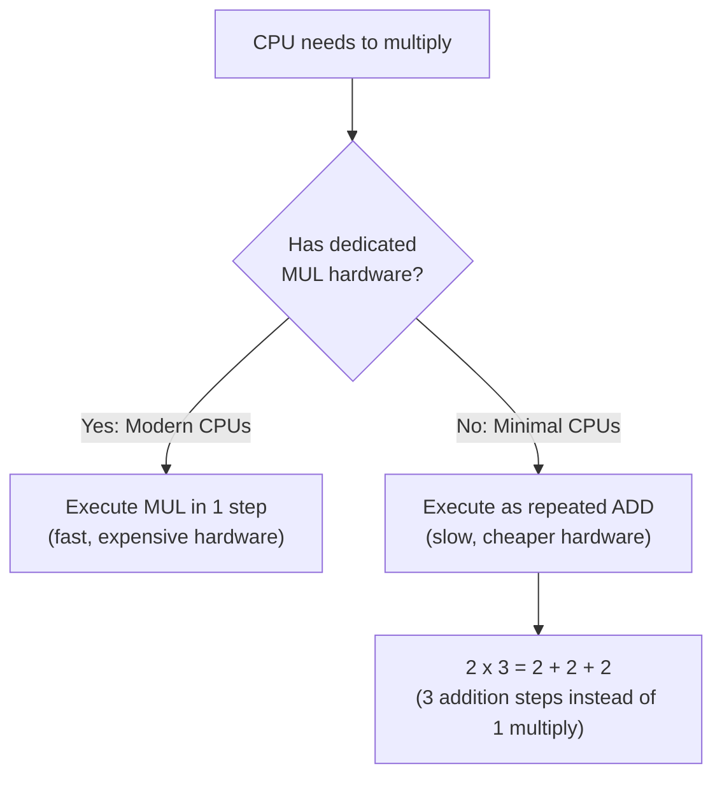
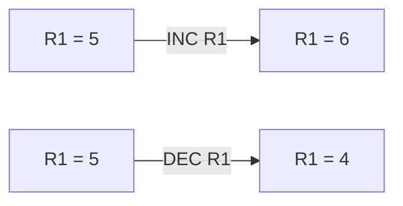
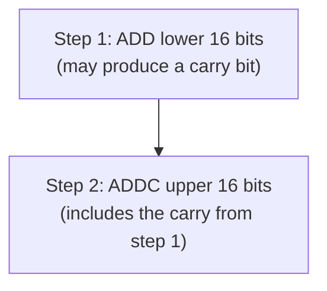
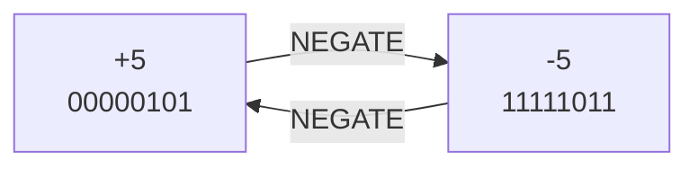
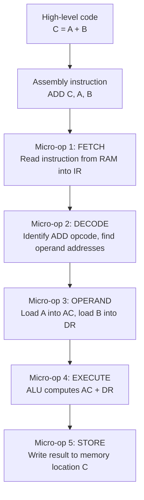

# Video 9: Arithmetic Instructions (Data Manipulation)

## Why this matters

Arithmetic instructions are the reason computers exist. Every calculation, from adding two numbers to running a physics simulation, comes down to the ALU performing arithmetic operations. Understanding these instructions also explains why some CPUs are faster than others: it depends on whether the hardware does multiplication directly or through repeated addition.

## Core Concept: The Four Basic Operations

The CPU performs four fundamental arithmetic operations:

| Operation | Instruction | What it does | Example |
|-----------|------------|-------------|---------|
| Addition | ADD | Adds two values | ADD R1, R2 (R1 = R1 + R2) |
| Subtraction | SUB | Subtracts one value from another | SUB R1, R2 (R1 = R1 - R2) |
| Multiplication | MUL | Multiplies two values | MUL R1, R2 (R1 = R1 * R2) |
| Division | DIV | Divides one value by another | DIV R1, R2 (R1 = R1 / R2) |

## Hardware vs Software: The Speed Trade-off

Not all CPUs have dedicated circuits for all four operations. This creates an important distinction:

| System Type | Hardware Available | How MUL works | How DIV works |
|-------------|-------------------|---------------|---------------|
| Modern CPU (Intel, AMD) | Dedicated circuits for all 4 | Single MUL instruction | Single DIV instruction |
| Minimal hardware system | Only Adder and Subtractor | Repeated addition loops | Repeated subtraction loops |

### Why this matters for performance

Multiplication by repeated addition is much slower. For example:
- `100 x 50` with dedicated hardware = 1 step
- `100 x 50` with repeated addition = 50 addition steps

This is why modern CPUs invest in dedicated multiplier and divider circuits.

## Additional Arithmetic Instructions

Beyond the basic four, CPUs provide several more arithmetic instructions:

### Increment (INC) and Decrement (DEC)

Add or subtract 1 from a register in a single clock pulse. Much faster than using ADD or SUB with the value 1.

Common use: loop counters, Program Counter increments.

### Add with Carry (ADDC) and Subtract with Borrow (SUBB)

Used when adding or subtracting numbers that are **larger than the register size**.

For example, adding two 32-bit numbers on a 16-bit CPU requires two steps:

| Instruction | What it does | When to use |
|-------------|-------------|-------------|
| ADDC | Adds two values plus the carry bit from the previous addition | Multi-word addition |
| SUBB | Subtracts two values and accounts for the borrow from previous subtraction | Multi-word subtraction |

### NEGATE

Converts a positive number to its negative form (or vice versa).

**How it works at hardware level**: Uses 2's complement representation.
- To negate a number: flip all bits, then add 1
- Example: +5 in 8-bit binary = `00000101`, negate = `11111011` (which is -5 in 2's complement)

## Instructions vs Micro-operations

An important distinction to understand:

| Level | What it is | Example |
|-------|-----------|---------|
| Instruction | A high-level assembly command | ADD C, A, B |
| Micro-operation | A single internal hardware step the CPU performs | Fetch instruction from memory |

One instruction is broken down into multiple micro-operations:

### The key takeaway

You write one ADD instruction, but the CPU performs 5 internal micro-operations to complete it. This is why understanding the instruction cycle (fetch, decode, execute) is so important.

## Key Terms

| Term | Meaning | Example |
|------|---------|---------|
| ADD | Add two values | ADD R1, R2 |
| SUB | Subtract one value from another | SUB R1, R2 |
| MUL | Multiply two values | MUL R1, R2 |
| DIV | Divide one value by another | DIV R1, R2 |
| INC | Add 1 to a register | INC R1 (R1 = R1 + 1) |
| DEC | Subtract 1 from a register | DEC R1 (R1 = R1 - 1) |
| ADDC | Add with carry from previous operation | Used in multi-word addition |
| SUBB | Subtract with borrow from previous operation | Used in multi-word subtraction |
| NEGATE | Convert positive to negative (2's complement) | NEGATE +5 = -5 |
| Micro-operation | A single internal hardware step | Fetching one instruction from RAM |
| 2's complement | Binary representation of negative numbers | -5 = 11111011 in 8-bit |

## Example: Full Execution of C = A + B

Let's trace every micro-operation when the CPU executes `ADD C, A, B`:

| Step | Micro-operation | What happens | Registers involved |
|------|----------------|-------------|-------------------|
| 1 | FETCH | PC sends address to memory, instruction word comes back into IR | PC, AR, IR |
| 2 | DECODE | Control Unit reads IR, identifies ADD opcode and operand addresses | IR, Control Unit |
| 3 | OPERAND (load A) | Value of A is loaded from memory into AC | AR, DR, AC |
| 4 | OPERAND (load B) | Value of B is loaded from memory into DR | AR, DR |
| 5 | EXECUTE | ALU adds AC + DR, result goes back to AC | AC, DR, ALU |
| 6 | STORE | AC value is written to memory location C | AC, AR, Memory |

## Summary

- The four basic arithmetic operations are ADD, SUB, MUL, and DIV
- Modern CPUs have dedicated hardware for all four, but minimal systems use repeated addition/subtraction for MUL/DIV
- INC and DEC add or subtract 1 in a single clock pulse
- ADDC and SUBB handle multi-word arithmetic by including carry/borrow bits
- NEGATE uses 2's complement to flip the sign of a number
- Each instruction is broken down into multiple micro-operations (fetch, decode, operand, execute, store)

## Quick Revision

- ADD, SUB = always in hardware. MUL, DIV = hardware in modern CPUs, software loops in minimal systems
- INC/DEC = add/subtract 1 in one clock pulse (faster than ADD/SUB with value 1)
- ADDC = add + carry bit from previous step (for multi-word math)
- NEGATE = flip bits + add 1 (2's complement)
- 1 instruction = many micro-operations (fetch, decode, operand, execute, store)
